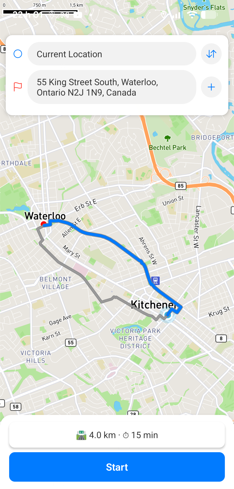
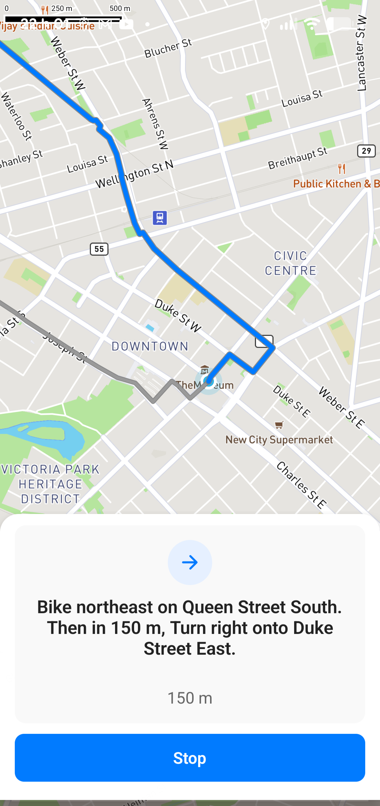
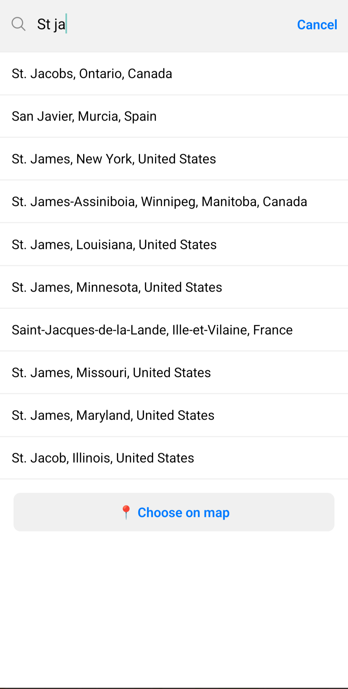

# 🚴‍♂️ Cycling Navigation App

A React Native app built with [Expo Router](https://expo.github.io/router/) and [Mapbox](https://www.mapbox.com/) that helps cyclists plan and follow routes.  

---

## ✨ Features

- 🗺️ **Interactive Map** – Browse routes on a Mapbox-powered map.
- 📍 **Route Planning** – Search for start and end locations with geocoding.
- 🔊 **Turn-by-Turn Navigation** – Spoken instructions and vibration alerts for each step.
- 📏 **Distance to Next Turn** – Real-time distance updates while navigating.
- 🔋 **Background Navigation** – Keeps tracking your ride even when the app is in the background.

---

## 📸 Screenshots

| Route Planning                                        | Navigation                                             | Search                                         |
|-------------------------------------------------------|--------------------------------------------------------|------------------------------------------------|
|  |  |  |

---

## Roadmap
- Offline support
- Custom route planner to replace mapbox API

---

## 🚀 Getting Started

This repo contains an expo app in the frontend directory. The backend is directory will be a custom route planning API.
